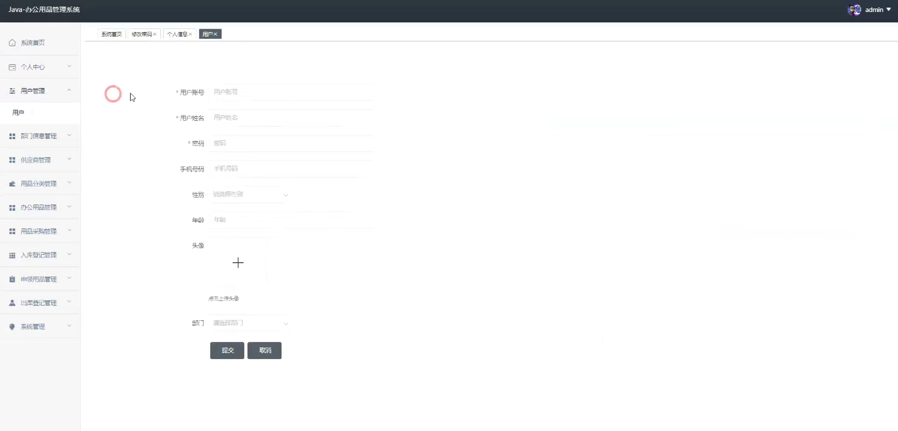
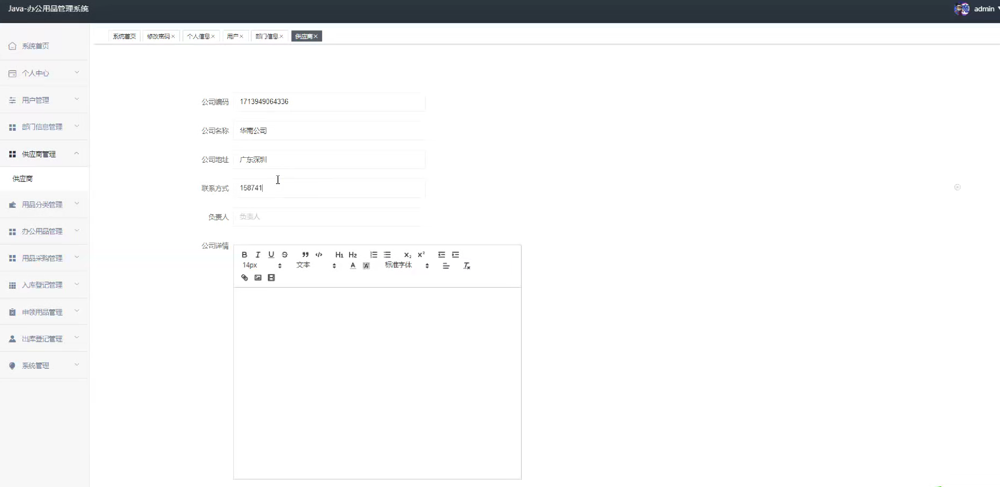
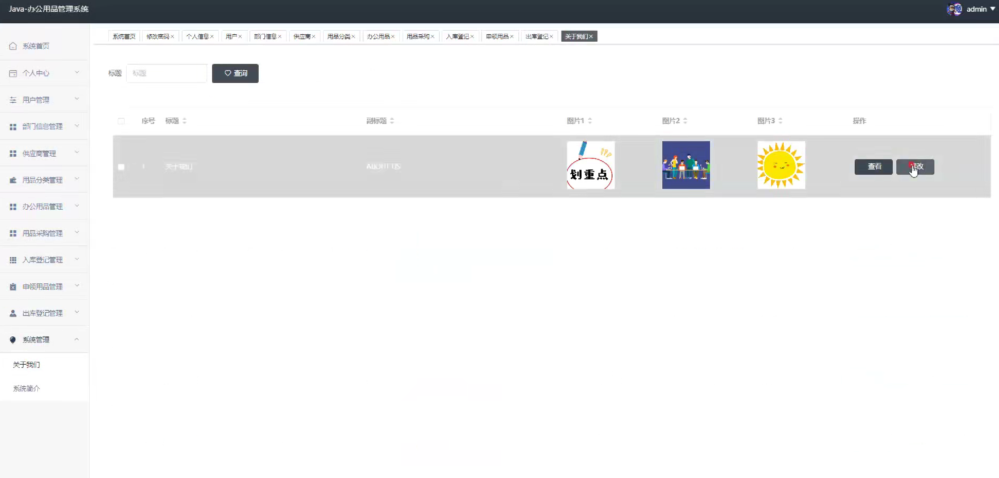
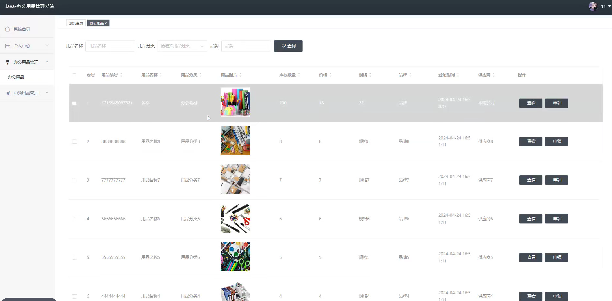

# 基于SpringBoot+Vue的办公用品管理系统

#### 介绍
基于SpringBoot+Vue的办公用品管理系统；附有完整源码➕数据库➕文档等。
本项目可以用于毕业设计，白嫖勿扰！
全网毕业设计项目这里都有

#### 课题背景
随着企事业单位规模的扩大和日常办公需求的增加，办公用品的管理逐渐成为提高企业运营效率和降低成本的重要环节。然而，传统的管理方式往往依赖手工记录或简单的电子表格，不仅效率低下，还容易出现信息滞后、数据错误和资源浪费等问题。基于此，开发一套数字化的办公用品管理系统势在必行。通过使用SpringBoot和Vue技术，可以实现前后端分离的高效系统架构，支持办公用品的采购、领用、归还、库存统计等全流程管理，为企业提供实时、精准的数据支持，提升管理效率，降低运营成本，助力企业实现现代化办公管理的目标。
#### 获取源码
V：13283346760

Q：985089028

注意：添加时备注项目名称

#### 软件架构
开发环境：JDK8、SpringBoot、Maven、MySQL、Vue

#### 安装教程

1.  下载IDEA集成开发工具
2.  配置Maven环境
3.  启动项目

#### 项目运行截图

